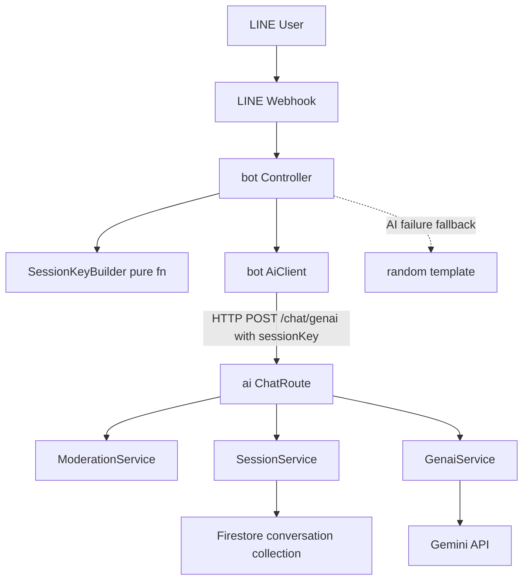
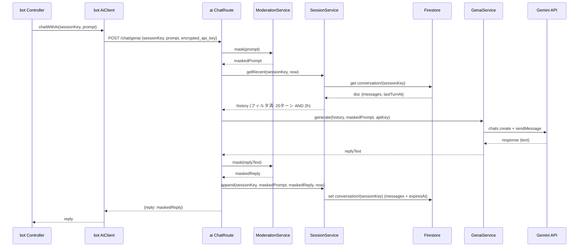
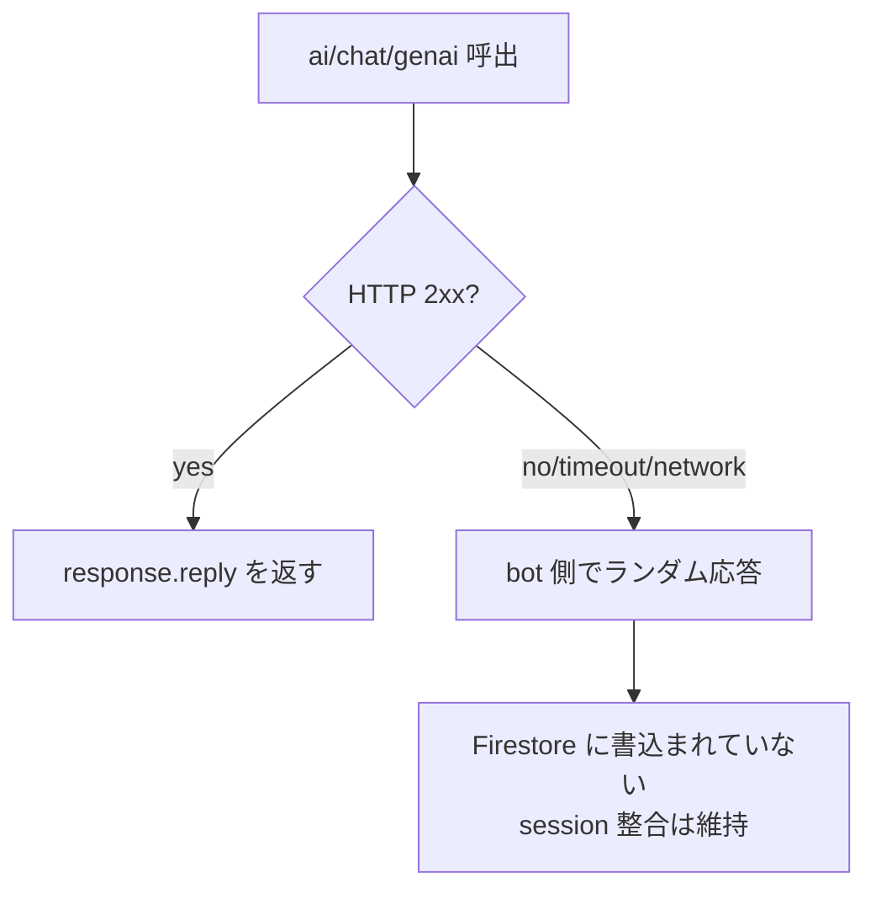
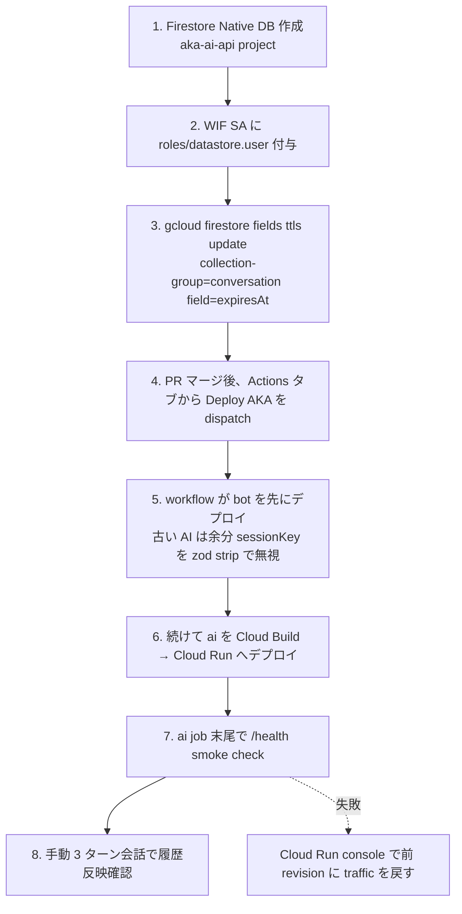

# Design Document: conversation-context

## Overview

**Purpose**: LINE Bot「あか」が会話の流れを覚えていられるよう、`ai/` (Cloud Run / Hono) にセッション単位の会話履歴 (Firestore) とマルチターン Gemini 呼び出しを導入する。同時に PII / 罵詈雑言マスキングを入力 / 出力 / 履歴保存の 3 ポイントに適用し、外部 LLM と保存履歴のいずれにも不適切情報を残さない。

**Users**: 妹と家族が LINE 上の「あか」と継続的な雑談を交わす。直前の会話を踏まえた応答が得られることで「あかとおしゃべりしている」体験が成立する。

**Impact**: `ai/` は今までの単発 `generateContent` 呼び出しから、`chats.create + sendMessage` ベースのステートフル呼び出しへ移行し、新たに Firestore (Native mode) を依存に加える。`bot/` は AI 呼び出しに `sessionKey` を同梱するだけの小さな変更。OpenAPI 契約は `ChatRequest.sessionKey` 必須追加で破壊的変更となる (まだ運用前提のため後方互換は考慮しない)。

### Goals

- 会話セッション単位 (group / room / user) で履歴を 24h 保持し、直近 20 ターン以内 / 2 時間以内の履歴を Gemini に渡せること
- ユーザー発話と LLM 応答の両方を Firestore 保存前にマスキング適用し、原文を永続化しないこと
- AI 呼び出し失敗時に bot 側の既存ランダム応答へ自動 fallback できること
- `bot/` と `ai/` の API 契約を OpenAPI SSOT で一致させ続けること

### Non-Goals

- 発話者個人 (お兄ちゃん / お姉ちゃん など) を履歴に乗せる
- 「@あか 忘れて」のような手動リセットコマンド
- 履歴の要約・長期記憶 (Vertex AI memory / RAG)
- LINE Webhook 真正性検証 (X-Line-Signature)
- OpenAI 等 Gemini 以外の LLM サポート
- フィーチャーフラグ等の段階リリース機構

## Boundary Commitments

### This Spec Owns

- 会話履歴の **モデル / 保存 / 取得 / 失効** (Firestore `conversation` collection)
- 履歴を踏まえた **マルチターン Gemini 呼び出し** (`ai/src/services/genai.ts`)
- **PII / 罵詈雑言マスキング** ロジックと辞書 vendor 取込 (`ai/src/services/moderation.ts` + `ai/vendor/inappropriate-words-ja/`)
- **SAFETY 中立メッセージ文言バンク** の集約 (`ai/src/prompts/aka.ts` 内、キャラ設定と同居)
- `ChatRequest.sessionKey` を含む **OpenAPI 契約** と再生成型
- `bot/` 側の **セッションキー組立**と AI client への同梱 (`bot/src/lib/sessionKey.ts`, `bot/src/aiClient.ts`)
- 上記に必要な **観測ログ** (構造化、原文出力禁止) と **エラー型**
- **統合 CD workflow** (`.github/workflows/deploy.yml`) による bot → ai 順序固定デプロイ (既存 `ai-deploy.yml` / `bot-deploy.yml` を統合・削除)
- **ローカル開発手順書** (`docs/local-dev.md`) で gcloud ADC を使った Firestore 接続前提を明文化

### Out of Boundary

- LINE Webhook の真正性検証 / メンション判定ロジック自体 (既存 `bot/src/lineMessageApi.ts` をそのまま使用)
- `bot/src/controller.ts` の **テンプレ応答パス** (挨拶 / 自己紹介 / `join` イベント) の文言・条件
- ai Dockerfile の構造 (依存追加で `pnpm-lock.yaml` 再生成が必要なだけ)
- LINE Profile API による表示名取得
- 既存 WIF (Workload Identity Federation) / `CLASPRC_JSON` Secret 構成の変更 (workflow 統合のみ、Secret 名や IAM 構成は流用)
- push / tag への自動デプロイトリガー (`workflow_dispatch` のみ維持)
- Firestore Emulator の導入 (ローカルからは production Firestore に ADC 直接接続)
- Cloud Run revision の自動ロールバック機構 (smoke 失敗時は手動対応)

### Allowed Dependencies

- `ai/` → `@google-cloud/firestore` v8.6.0 (NEW), `@google/genai` v1.0.0 (existing, usage change), `hono`, `zod`, `pino` (existing)
- `ai/` → Cloud Run の ADC (`new Firestore()` の暗黙認証)
- `bot/` → 既存 `UrlFetchApp.fetch` のみ。新規依存なし
- `openapi/` → 既存 `make oapi/types` パイプライン

### Revalidation Triggers

以下が変わった場合、本 spec の整合を再検証する:

- `ChatRequest` / `ChatResponse` のフィールド変更 (とくに `sessionKey` の必須/形式)
- Firestore `conversation` collection のドキュメント構造変更
- `@google/genai` のメジャーバージョンアップ (v2.x への移行など)
- `inappropriate-words-ja` 辞書フォーマットの破壊的変更 (vendor 再取込時に確認)
- WIF SA のロール構成変更 (`roles/datastore.user` 剥奪等)

## Architecture

### Existing Architecture Analysis

- **既存パターン**: `ai/` は `routes/` (Hono) → `services/` (薄いラッパ) → 外部 API の 3 層。各 service は Domain Error (`GenaiServiceError`, `ApiKeyDecodeError`) で例外を包んでから上に投げ、route 層が `ErrorResponse` に変換する
- **既存 DI/テスト**: `chat.test.ts` は `vi.mock('../src/services/genai')` 等で service 層を差し替え。今回新設する service も同パターンに乗る
- **既存制約**: ESM (`type: module`)、相対 import は `.js` 拡張子、OpenAPI 同期 (`make oapi/check-gen` CI)、Domain Error 包み込み

### Architecture Pattern & Boundary Map



**Architecture Integration**:

- **Selected pattern**: 既存 3 層 (routes → services → external) を維持。新規 2 サービス (`SessionService`, `ModerationService`) を services レイヤに追加し、`ChatRoute` 内で直接 orchestration
- **Domain/feature boundaries**: bot 側はセッションキー組立と AI 転送のみ、ai 側は履歴管理 + マスキング + Gemini 呼び出しを担当。マスキング辞書は ai 側のみに置く (bot は GAS のため重い辞書は load しない)
- **Existing patterns preserved**: Domain Error 包み込み / zod-OpenAPI 同期 / vi.mock テスト DI / `pino` 構造化ログ / Hono middleware (logger + errorHandler)
- **New components rationale**:
  - `SessionService`: Firestore I/O と履歴ウィンドウ計算を集約 (純関数 + 副作用関数の分離)
  - `ModerationService`: PII 正規表現と NG 辞書 Trie を共通インタフェース化 (Req 5.5 を実装で保証)
  - `BotSessionKeyBuilder`: bot 側で純関数として独立、テスト容易性のため
- **Steering compliance**: `.claude/rules/simplicity.md` の YAGNI/KISS、`.claude/rules/api.md` の OpenAPI SSOT、`.claude/rules/security.md` の secrets 取り扱い (Firestore は ADC で SA 経由のみ) を遵守

### Technology Stack

| Layer              | Choice / Version                                                                                         | Role in Feature                                                                        | Notes                                                                          |
| ------------------ | -------------------------------------------------------------------------------------------------------- | -------------------------------------------------------------------------------------- | ------------------------------------------------------------------------------ |
| Backend / Services | Hono 4.x + TypeScript 5.7 (existing)                                                                     | Route orchestration, zod バリデーション                                                | 変更なし                                                                       |
| External AI        | `@google/genai` v1.0.0 (existing, usage change)                                                          | Gemini multi-turn (`chats.create + sendMessage`) + `safetySettings`                    | 旧 `generateContent` 呼出を置き換え                                            |
| Data / Storage     | `@google-cloud/firestore` v8.6.0 (NEW)                                                                   | 会話履歴 store + TTL 24h                                                               | Native mode、ADC 経由                                                          |
| Vendor Asset       | `MosasoM/inappropriate-words-ja` (vendor `Sexual.txt`+`Offensive.txt`+`LICENSE`+`COMMIT`, SHA `e24de6e`) | 日本語罵詈雑言辞書                                                                     | npm パッケージなし、ライセンス MIT                                             |
| Logging            | `pino` (existing)                                                                                        | 構造化ログ、PII 原文を出さない                                                         | 既存 logger を再利用                                                           |
| Bot Runtime        | GAS + esbuild IIFE (existing)                                                                            | `sessionKey` 組立 + 同梱                                                               | 依存追加なし                                                                   |
| Infrastructure     | Cloud Run + WIF SA + `roles/datastore.user` (NEW role)                                                   | Firestore 認証 (production: ADC 自動 / local: `gcloud auth application-default login`) | `docs/deploy-setup.md` + `docs/local-dev.md` (NEW) 更新                        |
| Operational        | Firestore TTL policy on `expiresAt` field (NEW)                                                          | 24h 自動失効                                                                           | `gcloud firestore fields ttls update` で 1 回設定                              |
| CI/CD              | GitHub Actions 単一 `Deploy AKA` workflow (NEW, 既存 2 workflow を統合)                                  | `workflow_dispatch` のみ、bot → ai 直列実行                                            | `.github/workflows/deploy.yml`、既存 `ai-deploy.yml` / `bot-deploy.yml` を削除 |

## File Structure Plan

### Directory Structure

```
ai/
├── src/
│   ├── api/
│   │   └── generated.ts                  # [REGEN] openapi 再生成、sessionKey 含む
│   ├── config/
│   │   └── env.ts                        # [MOD]   Firestore env 追加 (GCP_PROJECT_ID 等)
│   ├── routes/
│   │   └── chat.ts                       # [MOD]   zod に sessionKey 必須、orchestration
│   ├── schemas/
│   │   └── chat.ts                       # [MOD]   zod sessionKey 追加
│   ├── services/
│   │   ├── genai.ts                      # [REFACT] chats.create + sendMessage + safetySettings + SAFETY ランダム選択
│   │   ├── session.ts                    # [NEW]   SessionService (Firestore CRUD + ウィンドウ)
│   │   └── moderation.ts                 # [NEW]   ModerationService (mask: pure)
│   ├── prompts/
│   │   └── aka.ts                        # [MOD]   キャラ設定 + SAFETY_FALLBACK_MESSAGES (3〜5 種類)
│   ├── lib/
│   │   ├── firestore.ts                  # [NEW]   Firestore client singleton (ADC)
│   │   ├── trie.ts                       # [NEW]   Simple Trie (NG ワード辞書用)
│   │   └── pickRandom.ts                 # [NEW]   配列からランダム選択する pure 関数 (SAFETY 用)
│   └── vendor/
│       └── inappropriate-words-ja/
│           ├── Sexual.txt                # [VEND]  辞書 (vendored)
│           ├── Offensive.txt             # [VEND]
│           ├── LICENSE                   # [VEND]  MIT (必須同梱)
│           └── COMMIT                    # [NEW]   SHA e24de6e ピン留めメモ
└── __tests__/
    ├── session.test.ts                   # [NEW]
    ├── moderation.test.ts                # [NEW]
    ├── pickRandom.test.ts                # [NEW]   (random 系の純関数 sanity check)
    └── chat.test.ts                      # [MOD]   sessionKey + multi-turn + SAFETY 経路追加

bot/
├── src/
│   ├── api/
│   │   └── generated.ts                  # [REGEN]
│   ├── lib/
│   │   └── sessionKey.ts                 # [NEW]   buildSessionKey(source): string | null
│   ├── aiClient.ts                       # [MOD]   sessionKey 同梱
│   └── controller.ts                     # [MOD]   sessionKey 組立 → aiClient
└── __tests__/
    ├── controller.test.ts                # [MOD]   sessionKey 経路追加
    └── sessionKey.test.ts                # [NEW]

openapi/
└── aka.openapi.yaml                      # [MOD]   ChatRequest.sessionKey 必須追加

.github/
└── workflows/
    ├── deploy.yml                        # [NEW]   統合 CD (bot → ai 直列、workflow_dispatch のみ)
    ├── ai-deploy.yml                     # [DEL]   deploy.yml に統合
    └── bot-deploy.yml                    # [DEL]   deploy.yml に統合

docs/
├── deploy-setup.md                       # [MOD]   Firestore 有効化、TTL policy、roles/datastore.user、deploy.yml 説明
└── local-dev.md                          # [NEW]   gcloud ADC 手順 + make ai/dev で Firestore に繋ぐ前提
```

### Modified Files

- `ai/package.json` — `@google-cloud/firestore` ^8.6.0 を dependencies に追加
- `ai/Dockerfile` — 依存追加のため `pnpm install` ステージはそのまま、`pnpm-lock.yaml` の再生成が前提
- `ai/src/lib/decode.ts` (既存、変更なし) — base64 API キー復号は引き続き利用

### Dependency Direction

```
vendor / generated → lib → schemas → services → routes → app → index
```

- `services` は `lib` と `vendor` のみ import 可能、`routes` から逆参照しない
- `routes` は `services` と `schemas` のみ import 可能
- `app.ts` が `routes` を集約

## System Flows

### Sequence: AI 応答 (history あり) の正常フロー



**Key decisions**:

- `Sess.append` は Gemini 成功後のみ実行 (Req 4.4 / 6.4)。失敗時は履歴に書き込まれず、整合が崩れない
- `Mod.mask` は入力と出力で同一実装 (Req 5.5)
- TTL の `expiresAt = lastTurnAt + 24h` を毎回 set し直すことで「沈黙すれば 24h 後に消える」モデルを実現

### Process: AI 失敗時の fallback



## Requirements Traceability

| Requirement     | Summary                                          | Components                        | Interfaces                                                             | Flows                    |
| --------------- | ------------------------------------------------ | --------------------------------- | ---------------------------------------------------------------------- | ------------------------ |
| 1.1 / 1.2 / 1.3 | source → sessionKey 組立                         | BotSessionKeyBuilder              | `buildSessionKey(source)`                                              | —                        |
| 1.4             | リクエストに sessionKey 同梱                     | BotAiClient                       | `chatWithAi(req)`                                                      | Sequence Step 1          |
| 1.5             | source 不明時に fallback                         | BotController                     | controller fallback path                                               | Process: fallback        |
| 2.1 / 2.5       | 履歴ペア追記 (マスク後)                          | SessionService, ModerationService | `session.append`, `moderation.mask`                                    | Sequence Step append     |
| 2.2             | 20 ターン上限・古い順破棄                        | SessionService                    | `session.append` 内で trim                                             | —                        |
| 2.3             | `expiresAt` 24h 設定                             | SessionService                    | `session.append`                                                       | —                        |
| 2.4             | TTL 削除後は新規扱い                             | SessionService                    | `session.getRecent` (空配列)                                           | —                        |
| 3.1 / 3.3       | 20 ターン AND 2h でフィルタ                      | SessionService                    | `session.getRecent`                                                    | —                        |
| 3.2             | 2h 超なら history なし                           | SessionService                    | `session.getRecent` (空返却)                                           | —                        |
| 4.1             | chats.create + history + systemInstruction       | GenaiService                      | `genai.generate`                                                       | Sequence Gemini          |
| 4.2             | safetySettings 4 カテゴリ BLOCK_MEDIUM_AND_ABOVE | GenaiService                      | `genai.generate` 内 config                                             | —                        |
| 4.3             | SAFETY 空応答時はエラー + 履歴に保存しない       | GenaiService, ChatRoute           | `GenaiSafetyBlockedError`                                              | —                        |
| 4.4             | 成功時のみ 1 操作で履歴追記                      | ChatRoute, SessionService         | route orchestration                                                    | Sequence append          |
| 5.1 / 5.2       | 入力時に PII + 罵詈雑言マスク                    | ModerationService                 | `moderation.mask`                                                      | Sequence Step mask       |
| 5.3             | 出力にも同一ルール適用                           | ModerationService                 | `moderation.mask`                                                      | Sequence Step mask reply |
| 5.4             | 履歴保存はマスク後のみ                           | ChatRoute                         | route の append 引数                                                   | —                        |
| 5.5             | 3 ポイントで同一実装                             | ModerationService                 | 単一 `mask(text)` 関数                                                 | —                        |
| 6.1             | 定型パターンは AI 呼ばずテンプレ                 | BotController                     | controller routing                                                     | —                        |
| 6.2             | 非定型は AI 転送                                 | BotController                     | controller routing                                                     | Sequence Step 1          |
| 6.3             | AI 失敗時 random fallback                        | BotController                     | controller catch                                                       | Process: fallback        |
| 6.4             | bot から履歴側を触らない                         | BotController, BotAiClient        | (副作用なし)                                                           | Process: fallback        |
| 7.1             | `ChatRequest.sessionKey` 必須                    | OpenAPI Schema                    | yaml schema                                                            | —                        |
| 7.2 / 7.3       | 型再生成と CI チェック                           | Build Pipeline                    | `make oapi/types`, `make oapi/check-gen`                               | —                        |
| 7.4 / 7.5       | zod 必須 + 400 返却                              | ChatRoute                         | zValidator + ErrorResponse                                             | —                        |
| 8.1 / 8.2       | 構造化ログ、原文出力なし                         | ChatRoute, ModerationService      | pino logger                                                            | —                        |
| 8.3             | Firestore 失敗で 500                             | SessionService, ChatRoute         | `SessionStoreError` → ErrorResponse                                    | —                        |
| 8.4             | 内部詳細を LINE に転送しない                     | BotController, BotAiClient        | catch + fallback                                                       | Process: fallback        |
| 4.5             | SAFETY 中立メッセージを `prompts/aka.ts` に集約  | GenaiService, prompts/aka.ts      | `SAFETY_FALLBACK_MESSAGES`, `pickRandom`                               | —                        |
| 9.1 / 9.2       | 単一 `Deploy AKA` workflow で bot → ai 直列      | DeployWorkflow                    | `.github/workflows/deploy.yml` (jobs.bot → jobs.ai needs:)             | Process: CD              |
| 9.3             | bot deploy 失敗で ai deploy skip                 | DeployWorkflow                    | jobs.ai `needs: bot`                                                   | Process: CD              |
| 9.4             | ai deploy 後 `/health` smoke check               | DeployWorkflow                    | jobs.ai 末尾の curl step                                               | Process: CD              |
| 9.5             | 既存 `ai-deploy.yml` / `bot-deploy.yml` 削除     | DeployWorkflow                    | (削除対象ファイル)                                                     | —                        |
| 9.6             | 既存 WIF / Secret 構成を流用                     | DeployWorkflow                    | 同 secrets (`GCP_WIF_PROVIDER`, `GCP_SERVICE_ACCOUNT`, `CLASPRC_JSON`) | —                        |
| 9.7             | smoke 失敗時の自動 rollback なし                 | DeployWorkflow                    | (失敗で workflow exit、手動対応)                                       | —                        |

## Components and Interfaces

### Component Summary

| Component            | Domain/Layer        | Intent                                         | Req Coverage                           | Key Dependencies (P0/P1)                                       | Contracts      |
| -------------------- | ------------------- | ---------------------------------------------- | -------------------------------------- | -------------------------------------------------------------- | -------------- |
| BotSessionKeyBuilder | bot / lib           | LINE source から sessionKey を組み立てる純関数 | 1.1, 1.2, 1.3                          | LineEvent.source 型 (P0)                                       | Service        |
| BotAiClient          | bot / client        | AI への HTTP 呼び出し (sessionKey 同梱)        | 1.4, 6.3, 6.4                          | `UrlFetchApp` (P0), generated `ChatRequest` (P0)               | Service, API   |
| BotController        | bot / orchestration | ルーティング (テンプレ→AI→fallback)            | 1.5, 6.1, 6.2, 6.3, 6.4, 8.4           | BotAiClient (P0), BotSessionKeyBuilder (P0)                    | Service        |
| AiChatRoute          | ai / route          | リクエストバリデーション + orchestration       | 2.5, 4.4, 5.4, 7.4, 7.5, 8.1, 8.3      | ModerationService (P0), SessionService (P0), GenaiService (P0) | API            |
| ModerationService    | ai / service        | PII + 罵詈雑言マスク (pure)                    | 5.1, 5.2, 5.3, 5.5, 8.2                | NG 辞書 (P0), Trie (P0)                                        | Service        |
| SessionService       | ai / service        | Firestore 履歴 CRUD + ウィンドウ計算           | 2.1, 2.2, 2.3, 2.4, 3.1, 3.2, 3.3, 8.3 | Firestore (P0)                                                 | Service, State |
| GenaiService         | ai / service        | Gemini multi-turn 呼び出し + safetySettings    | 4.1, 4.2, 4.3                          | `@google/genai` (P0), prompts/aka.ts (P0)                      | Service        |
| OpenAPI Schema       | contract            | `ChatRequest.sessionKey` 追加                  | 7.1, 7.2                               | openapi-typescript (P0)                                        | API            |
| DeployWorkflow       | CI/CD               | 単一 workflow で bot → ai 順次デプロイ         | 9.1〜9.7                               | GitHub Actions, WIF, CLASPRC_JSON Secret (P0)                  | Batch          |

---

### bot / lib

#### BotSessionKeyBuilder

| Field        | Detail                                                                                                    |
| ------------ | --------------------------------------------------------------------------------------------------------- |
| Intent       | LINE event の `source` から `group:` / `room:` / `user:` プレフィックス付き sessionKey を組み立てる純関数 |
| Requirements | 1.1, 1.2, 1.3                                                                                             |

**Responsibilities & Constraints**

- 入力は LINE event の `source` オブジェクトのみ。副作用なし
- `source.type` が想定外、または対応する ID が欠落していたら `null` を返す
- セッションキーの形式: `${type}:${id}` (例: `group:Cabc...`、`user:Uabc...`)

**Dependencies**

- Inbound: BotController — `source` を渡される (P0)
- Outbound: なし
- External: なし

**Contracts**: Service [x]

##### Service Interface

```typescript
import type { LineEventSource } from "../types/line";

export type SessionKey = `${"group" | "room" | "user"}:${string}`;

export function buildSessionKey(source: LineEventSource): SessionKey | null;
```

- Preconditions: `source` は LINE Webhook から得たオブジェクト
- Postconditions: 返り値は `null` または `${type}:${id}` 形式
- Invariants: `source` を改変しない

**Implementation Notes**

- Integration: `BotController` が AI 呼び出し直前に組み立て、`BotAiClient` に渡す
- Validation: `buildSessionKey` 内で空文字 / undefined / 未対応 type を弾く
- Risks: LINE Webhook フォーマット変更時に `null` 経路が増える可能性 → `lineMessageApi.ts` の既存 webhook 型を共有

---

### bot / client

#### BotAiClient

| Field        | Detail                                                        |
| ------------ | ------------------------------------------------------------- |
| Intent       | `ai/chat/genai` への POST 呼び出し。`sessionKey` 必須化に対応 |
| Requirements | 1.4, 6.3, 6.4                                                 |

**Responsibilities & Constraints**

- 既存と同じく `UrlFetchApp.fetch` でリクエストを送信
- `sessionKey` を payload に同梱
- HTTP 非 2xx / network エラー / タイムアウトは catch して `null` を返す (controller 側で fallback)
- 履歴側 (Firestore) は決して直接触らない

**Dependencies**

- Inbound: BotController (P0)
- Outbound: `ai/chat/genai` HTTP endpoint (P0)
- External: GAS `UrlFetchApp` (P0)

**Contracts**: Service [x] / API [x]

##### Service Interface

```typescript
import type { components } from "./api/generated";

type ChatRequest = components["schemas"]["ChatRequest"];
type ChatResponse = components["schemas"]["ChatResponse"];

export function chatWithAi(
  prompt: string,
  encryptedApiKey: string,
  sessionKey: string,
): string | null;
```

- Preconditions: `prompt` 非空、`encryptedApiKey` 非空、`sessionKey` 非空
- Postconditions: HTTP 200 なら `reply` を返す、それ以外は `null`
- Invariants: 内部エラー詳細を返り値・例外で外部に漏らさない

##### API Contract

| Method | Endpoint      | Request                                              | Response              | Errors                                                      |
| ------ | ------------- | ---------------------------------------------------- | --------------------- | ----------------------------------------------------------- |
| POST   | `/chat/genai` | `ChatRequest{sessionKey, prompt, encrypted_api_key}` | `ChatResponse{reply}` | 400 invalid_request / 500 internal_error / 502 genai_failed |

**Implementation Notes**

- Integration: 生成型 `components["schemas"]["ChatRequest"]` のみを使用、手書き型を作らない
- Validation: 引数の空文字チェックを呼び出し側 (controller) で実施
- Risks: GAS の `UrlFetchApp.fetch` はストリーミング非対応のため Gemini が長い応答を返すとタイムアウト。現状の単発生成では問題なし

---

### bot / orchestration

#### BotController

| Field        | Detail                                                                     |
| ------------ | -------------------------------------------------------------------------- |
| Intent       | 受信メッセージのルーティング (テンプレ → AI → fallback) と sessionKey 組立 |
| Requirements | 1.5, 6.1, 6.2, 6.3, 6.4, 8.4                                               |

**Responsibilities & Constraints**

- 完全一致 / 挨拶 / 自己紹介 → テンプレ即応 (既存パス維持)
- それ以外でメンション / DM → `BotSessionKeyBuilder` で sessionKey 組立 → `BotAiClient.chatWithAi` 呼出
- `chatWithAi` が `null` を返したら既存 random fallback
- `sessionKey` が `null` のときも AI を呼ばず fallback に切り替え
- LINE エンドユーザーに内部エラー詳細を絶対に転送しない

**Dependencies**

- Inbound: `lineMessageApi.ts` から `generateReply` を呼ばれる (P0)
- Outbound: BotAiClient (P0), BotSessionKeyBuilder (P0), 既存 `aka.ts` テンプレ (P0)

**Contracts**: Service [x]

##### Service Interface

```typescript
import type { LineEvent } from "./types/line";

export interface ControllerDeps {
  ai?: (
    prompt: string,
    encryptedApiKey: string,
    sessionKey: string,
  ) => string | null;
  sessionKeyBuilder?: (source: LineEvent["source"]) => string | null;
}

export function generateReply(event: LineEvent, deps?: ControllerDeps): string;
```

- Preconditions: `event` は LINE message event
- Postconditions: 必ず非空文字列を返す (fallback あり)
- Invariants: `deps.ai` の例外を呼出側に伝播させない

**Implementation Notes**

- Integration: 既存テスト `controller.test.ts` の DI パターンに `sessionKeyBuilder` を追加
- Validation: `sessionKey === null` は AI 経路をスキップして fallback
- Risks: AI 呼び出しが長時間ブロックすると LINE Webhook の 1 リクエスト処理時間を圧迫 → 既存制約と同じ、本 spec で変えない

---

### ai / service

#### ModerationService

| Field        | Detail                                                                |
| ------------ | --------------------------------------------------------------------- |
| Intent       | テキストから PII (正規表現) と罵詈雑言 (Trie 辞書) を伏字化する純関数 |
| Requirements | 5.1, 5.2, 5.3, 5.5, 8.2                                               |

**Responsibilities & Constraints**

- NFKC 正規化を前処理として実行 (全角→半角等を統一)
- PII 正規表現: 電話番号 (携帯 / 固定)、メール、クレジットカード (Luhn 合格)、マイナンバー (12 桁)、郵便番号
- 辞書: `vendor/inappropriate-words-ja/{Sexual.txt, Offensive.txt}` を起動時に Trie 構築 (module top-level、1 回)
- 副作用なし、入力文字列を改変しない
- 内部で原文をログに出さない (Req 8.2)

**Dependencies**

- Inbound: AiChatRoute (P0)
- Outbound: `lib/trie.ts` (P0), `vendor/inappropriate-words-ja/*.txt` (P0)
- External: なし (npm 依存ゼロ)

**Contracts**: Service [x]

##### Service Interface

```typescript
export interface MaskResult {
  masked: string;
  redactionCount: { pii: number; profanity: number };
}

export function mask(text: string): MaskResult;
```

- Preconditions: `text` は string (空文字 OK)
- Postconditions: `masked` は同等長以下、`redactionCount` は非負整数
- Invariants: 同一入力に対して常に同一出力 (純関数)

**Implementation Notes**

- Integration: AiChatRoute から「入力直後 / 出力直前」の 2 箇所で呼ばれる、同一関数を共有することで Req 5.5 を保証
- Validation: 内部で原文をログ出力しない、`redactionCount` のみログに乗せる (Req 8.1)
- Risks: 辞書 Trie 構築は module 初回 import 時にブロック。Cloud Run cold start に +数 ms 程度の見込み (64KB)

---

#### SessionService

| Field        | Detail                                                                                  |
| ------------ | --------------------------------------------------------------------------------------- |
| Intent       | Firestore `conversation` collection の CRUD と「履歴ウィンドウ (20 ターン AND 2h)」計算 |
| Requirements | 2.1, 2.2, 2.3, 2.4, 3.1, 3.2, 3.3, 8.3                                                  |

**Responsibilities & Constraints**

- ドキュメント形: `conversation/{sessionKey}` = `{ messages: Message[], lastTurnAt: Timestamp, expiresAt: Timestamp }`
- `Message` = `{ role: 'user' | 'model', text: string, ts: Timestamp }`
- `getRecent(sessionKey, now)`: ドキュメント取得 → 「直近 20 ターン AND 最終発話から 2h 以内」でフィルタ
- `append(sessionKey, userText, modelText, now)`: 1 トランザクションで 2 メッセージ追加、20 ターン超は古い順に破棄、`lastTurnAt = now`、`expiresAt = now + 24h`
- Firestore I/O 失敗は `SessionStoreError` で包んで投げる

**Dependencies**

- Inbound: AiChatRoute (P0)
- Outbound: `lib/firestore.ts` で取得した `Firestore` クライアント (P0)
- External: `@google-cloud/firestore` v8.6.0 (P0)

**Contracts**: Service [x] / State [x]

##### Service Interface

```typescript
import { Timestamp } from "@google-cloud/firestore";

export interface ConversationMessage {
  role: "user" | "model";
  text: string;
  ts: Timestamp;
}

export class SessionStoreError extends Error {}

export interface SessionService {
  getRecent(sessionKey: string, now: Date): Promise<ConversationMessage[]>;
  append(
    sessionKey: string,
    userText: string,
    modelText: string,
    now: Date,
  ): Promise<void>;
}
```

- Preconditions: `sessionKey` 非空、`now` は呼び出し時刻
- Postconditions: `getRecent` は最大 20 件、空配列もあり得る
- Invariants: `getRecent` は副作用なし、`append` は冪等ではない (毎回追記)

##### State Management

- **State model**: `conversation/{sessionKey}` の `messages` は append-only round-robin (20 件で trim)
- **Persistence & consistency**: 単一ドキュメント `set({ merge: false })` で原子的書き込み。`runTransaction` は不要 (同一 sessionKey の並行書き込みは LINE の単一ユーザ起源で実用上稀)
- **Concurrency strategy**: Last-Writer-Wins (LWW)。並行投稿で 1 ターン取りこぼし許容

**Implementation Notes**

- Integration: `lib/firestore.ts` の singleton から `Firestore` を取得、`new Firestore()` は ADC で認証
- Validation: `getRecent` 内で TTL 削除済 / ドキュメント不在は空配列を返す (Req 2.4)
- Risks: 同一 sessionKey への並行書き込みで取りこぼし → 個人 LINE Bot 規模では非実用的なシナリオ、容認

---

#### GenaiService (Refactored)

| Field        | Detail                                                                                                                    |
| ------------ | ------------------------------------------------------------------------------------------------------------------------- |
| Intent       | Gemini `@google/genai` chats API を使ったマルチターン応答生成、safetySettings 設定、SAFETY 時の中立メッセージランダム選択 |
| Requirements | 4.1, 4.2, 4.3, 4.5                                                                                                        |

**Responsibilities & Constraints**

- `ai.chats.create({ model, config: { safetySettings, systemInstruction }, history })` でセッションを毎回新規作成 (Cloud Run instance 寿命内でキャッシュしない)
- `safetySettings` は 4 カテゴリ `HARM_CATEGORY_HARASSMENT` / `_HATE_SPEECH` / `_SEXUALLY_EXPLICIT` / `_DANGEROUS_CONTENT` を `BLOCK_MEDIUM_AND_ABOVE`
- SAFETY ブロック (`finishReason === SAFETY`) または空 candidates は `GenaiSafetyBlockedError` で投げる
- ChatRoute が `GenaiSafetyBlockedError` を捕捉した際に `prompts/aka.ts` の `SAFETY_FALLBACK_MESSAGES` (3〜5 種類) から `lib/pickRandom.ts` の純関数で 1 つを選んで 200 で返す (Req 4.3, 4.5)
- それ以外の Gemini エラーは既存 `GenaiServiceError` で包む

**Dependencies**

- Inbound: AiChatRoute (P0)
- Outbound: `prompts/aka.ts` (P0, systemInstruction の source)
- External: `@google/genai` v1.0.0 (P0), Gemini API (P0)

**Contracts**: Service [x]

##### Service Interface

```typescript
import type { ConversationMessage } from "./session";

export class GenaiServiceError extends Error {}
export class GenaiSafetyBlockedError extends GenaiServiceError {}

export interface GenaiGenerateInput {
  history: ConversationMessage[];
  userText: string;
  encryptedApiKey: string;
}

export interface GenaiService {
  generate(input: GenaiGenerateInput): Promise<string>;
}
```

- Preconditions: `userText` 非空、`encryptedApiKey` 復号可能
- Postconditions: 非空 reply 文字列を返す
- Invariants: SAFETY ブロックや空応答は必ず例外 (silent empty string を返さない)

**Implementation Notes**

- Integration: 既存 `decode.ts` で `encryptedApiKey` を復号、毎リクエストで `new GoogleGenAI({ apiKey })` を作成
- Validation: `res.text` が undefined / 空文字なら `GenaiSafetyBlockedError`
- Risks: `@google/genai` v1.0.0 の chats API シグネチャ将来変更 (revalidation trigger)

---

### ai / route

#### AiChatRoute (Refactored)

| Field        | Detail                                                                                  |
| ------------ | --------------------------------------------------------------------------------------- |
| Intent       | `/chat/genai` POST endpoint。zod バリデーション + 3 サービス orchestration + エラー変換 |
| Requirements | 2.5, 4.4, 5.4, 7.4, 7.5, 8.1, 8.3                                                       |

**Responsibilities & Constraints**

- zod スキーマで `sessionKey` 必須 (`min(1)`)、`prompt` 必須、`encrypted_api_key` 必須
- バリデーション失敗 → 400 `invalid_request`
- 順序: `mask(prompt)` → `session.getRecent` → `genai.generate(history, masked, key)` → `mask(reply)` → `session.append(masked, maskedReply)` → 200 返却
- Gemini 成功後のみ `session.append` (Req 4.4)
- `GenaiSafetyBlockedError` → 200 で中立的なメッセージ (履歴に保存しない、Req 4.3)
- `GenaiServiceError` (SAFETY 以外) → 502 `genai_failed`
- `SessionStoreError` → 500 `internal_error`
- pino で構造化ログ (`sessionKey`, `historyTurns`, `geminiDurationMs`, `piiRedactions`, `profanityRedactions`)

**Dependencies**

- Inbound: Hono app (`/chat/genai`) (P0)
- Outbound: ModerationService (P0), SessionService (P0), GenaiService (P0)
- External: `@hono/zod-validator` (existing)

**Contracts**: API [x]

##### API Contract

| Method | Endpoint      | Request                                              | Response                    | Errors                                                      |
| ------ | ------------- | ---------------------------------------------------- | --------------------------- | ----------------------------------------------------------- |
| POST   | `/chat/genai` | `ChatRequest{sessionKey, prompt, encrypted_api_key}` | `ChatResponse{reply}` (200) | 400 invalid_request / 500 internal_error / 502 genai_failed |

**Implementation Notes**

- Integration: 既存 Hono middleware (`logger`, `errorHandler`) をそのまま流用
- Validation: zod の `min(1)` を sessionKey / prompt / encrypted_api_key すべてに適用、エラーは zValidator が自動で 400 化
- Risks: orchestration を route 内に直書きするためテストはモック注入で 6 つ以上のケース (正常 / SAFETY / Genai err / Session err / 入力不正 / 履歴空) が必要

---

### contract

#### OpenAPI Schema

| Field        | Detail                                                                                         |
| ------------ | ---------------------------------------------------------------------------------------------- |
| Intent       | `ChatRequest` に `sessionKey: string (minLength:1)` を必須追加し、`make oapi/types` で型再生成 |
| Requirements | 7.1, 7.2, 7.3                                                                                  |

**Responsibilities & Constraints**

- yaml を SSOT として保持
- 型再生成成果物 `ai/src/api/generated.ts` / `bot/src/api/generated.ts` を必ずコミットに含める
- CI `make oapi/check-gen` で yaml と生成型の差分検出

**Dependencies**

- Inbound: ai (zod スキーマ整合), bot (`chatWithAi` 引数型) (P0)
- Outbound: `openapi-typescript` (P0)

**Contracts**: API [x]

##### API Contract

- `ChatRequest`:
  ```yaml
  ChatRequest:
    type: object
    required: [sessionKey, prompt, encrypted_api_key]
    properties:
      sessionKey: { type: string, minLength: 1 }
      prompt: { type: string, minLength: 1 }
      encrypted_api_key: { type: string, minLength: 1 }
  ```

**Implementation Notes**

- Integration: yaml 編集後 `make oapi/types` 必須、PR に diff 同梱
- Validation: CI `make oapi/check-gen` が `git diff --exit-code` で乖離検出
- Risks: 既存 bot/ai 間が動作中の状態でデプロイ順を間違えると 400 が出る → **`DeployWorkflow` で bot → ai の順序を強制 (Req 9.2)**

---

### CI/CD

#### DeployWorkflow

| Field        | Detail                                                                                                                                  |
| ------------ | --------------------------------------------------------------------------------------------------------------------------------------- |
| Intent       | 単一 `.github/workflows/deploy.yml` で bot → ai を直列実行し、`ChatRequest.sessionKey` 必須化のような破壊的変更でも順序ミスを起こさない |
| Requirements | 9.1, 9.2, 9.3, 9.4, 9.5, 9.6, 9.7                                                                                                       |

**Responsibilities & Constraints**

- トリガー: `workflow_dispatch` のみ。push / tag 自動トリガーは入れない (Req 9.1)
- ジョブ構成:
  1. `bot`: clasp credentials 復元 → `pnpm --filter bot build` → `clasp push --force`
  2. `ai` (needs: `bot`): WIF 認証 → `gcloud builds submit` → `gcloud run deploy` → `/health` smoke check (curl 失敗で workflow fail)
- `ai` ジョブは `needs: bot` で **bot 成功時のみ起動** (Req 9.3)
- 既存 `ai-deploy.yml` / `bot-deploy.yml` は削除 (Req 9.5)
- 既存 Secret (`GCP_WIF_PROVIDER`, `GCP_SERVICE_ACCOUNT`, `CLASPRC_JSON`) と IAM 構成はそのまま流用 (Req 9.6)
- smoke check 失敗時の Cloud Run revision 自動 rollback はしない (Req 9.7)、`docs/deploy-setup.md` に手動 rollback 手順を追記

**Dependencies**

- Inbound: 運用者 (Actions タブからの手動起動) (P0)
- Outbound: Cloud Build → Cloud Run、Google Apps Script (clasp 経由) (P0)
- External: GitHub Actions runner、`google-github-actions/auth`、`google-github-actions/setup-gcloud` (P0)

**Contracts**: Batch [x]

##### Batch / Job Contract

- **Trigger**: `workflow_dispatch` (input: `ref` = ブランチ / タグ / SHA、デフォルト `master`)
- **Input / validation**: 既存 Secrets が登録済であること、`ref` が存在すること
- **Output / destination**:
  - GAS project (`bot/.clasp.json` の scriptId)
  - Cloud Run service `aka-ai-api-service` (region `asia-northeast1`)
- **Idempotency & recovery**: clasp push と Cloud Run deploy はいずれも冪等。失敗時は workflow を再起動するか、Cloud Run console から前 revision に手動で traffic を戻す

**Implementation Notes**

- Integration: 既存 `ai-deploy.yml` / `bot-deploy.yml` のステップをほぼそのまま 2 ジョブに分けて統合する
- Validation: 初回マージ後に手動で 1 回 dispatch して bot → ai の順序と smoke check の合否を確認
- Risks: GitHub Actions の `needs:` は 1 ジョブの完全成功を待つため bot のテストや lint failure でも ai が止まる → 個人プロジェクトとしては望ましい挙動 (片肺デプロイを避ける)

---

## Data Models

### Domain Model

- **Aggregate root**: `ConversationSession` (key: `sessionKey`)
- **Entities/value objects**:
  - `Message` = (role, text, ts)
  - `Session` = (sessionKey, messages[], lastTurnAt, expiresAt)
- **Invariants**:
  - `messages.length <= 20` (append-only round-robin)
  - `expiresAt = lastTurnAt + 24h`
  - `text` は常にマスキング適用後 (Req 5.4)

### Physical Data Model (Firestore Native)

**Collection**: `conversation`
**Document key**: `sessionKey` (例: `group:Cabc...`)

```ts
// Firestore document shape
{
  messages: [
    { role: "user",  text: "おはよう",       ts: Timestamp },
    { role: "model", text: "おはよう、おにいちゃん！", ts: Timestamp },
    // ... 最大 20 件
  ],
  lastTurnAt: Timestamp,    // 最後の発話 (user or model) の時刻
  expiresAt: Timestamp,     // TTL field: lastTurnAt + 24h
}
```

- **TTL policy**: `expiresAt` フィールドに対し Firestore TTL policy を有効化 (gcloud で 1 回設定)
- **Index**: 単一ドキュメント lookup のため追加 index 不要
- **サイズ見積**: 1 message ~ 200B、20 件 + メタ 4KB ≪ 1MB ドキュメント上限
- **Sharding**: 不要 (個人 Bot 規模)

### Data Contracts (API Layer)

`ChatRequest` / `ChatResponse` は OpenAPI Schema セクション参照。両者は生成型を import して使用 (手書き型禁止)。

## Error Handling

### Error Strategy

| エラー源                                     | 種別           | HTTP / Bot 挙動                                                                                                           |
| -------------------------------------------- | -------------- | ------------------------------------------------------------------------------------------------------------------------- |
| zod バリデーション失敗                       | User Error     | 400 `invalid_request`                                                                                                     |
| `ModerationError` (起動失敗等、通常発生せず) | System Error   | 500 `internal_error`                                                                                                      |
| `SessionStoreError` (Firestore 系)           | System Error   | 500 `internal_error` → bot は random fallback                                                                             |
| `GenaiSafetyBlockedError`                    | Business Logic | 200 で `prompts/aka.ts` の `SAFETY_FALLBACK_MESSAGES` (3〜5 種類) から `pickRandom` で 1 つ選んで返す、履歴には保存しない |
| `GenaiServiceError` (SAFETY 以外)            | Upstream Error | 502 `genai_failed` → bot は random fallback                                                                               |
| bot 側で AI HTTP 非 2xx / timeout            | Bot 内         | `chatWithAi` が `null` → controller が random fallback                                                                    |

### Monitoring

- pino 構造化ログのフィールド: `sessionKey`, `historyTurns`, `geminiDurationMs`, `piiRedactions`, `profanityRedactions`, `finishReason`, `errorClass`
- 原文 (マスク前テキスト) はログに出力しない (Req 8.2)
- Cloud Logging に直接吐き出され、Stackdriver で `errorClass` でフィルタリング可

## Testing Strategy

要件由来のテスト項目を以下に列挙する (汎用パターンではなく、本仕様の component と振る舞いを参照)。

### Unit Tests

1. **`buildSessionKey`** (bot): `source.type=group/room/user` の 3 パターンで正しい prefix が付くこと、ID 欠落時に `null` を返すこと → Req 1.1〜1.3, 1.5
2. **`ModerationService.mask`** (ai): 電話番号 (全角含む)、メール、Luhn 通過カード、マイナンバー、郵便番号がそれぞれ `[REDACTED]` に置換されること → Req 5.1
3. **`ModerationService.mask`** (ai): NG 辞書語が `***` に置換されること、`redactionCount` が正しいこと → Req 5.2, 8.2 (ログ用)
4. **`SessionService.getRecent`** (ai, Firestore モック): 21 件以上ある場合に直近 20 件のみ返ること、最終発話から 2h 超過なら空配列を返ること → Req 2.2, 3.1, 3.2
5. **`SessionService.append`** (ai, Firestore モック): `expiresAt = lastTurnAt + 24h` が設定されること、超過 message を古い順に破棄すること → Req 2.2, 2.3

### Integration Tests

1. **`/chat/genai` 正常系** (ai, 全 service モック): mask → getRecent → genai → mask → append の順で呼ばれ、200 と `ChatResponse{reply}` が返ること → Req 4.4, 5.3, 5.4, 5.5
2. **`/chat/genai` SAFETY ブロック** (ai): `GenaiSafetyBlockedError` 投げる → 200 + 中立メッセージ、`session.append` が呼ばれないこと → Req 4.3
3. **`/chat/genai` Firestore 失敗** (ai): `SessionStoreError` 投げる → 500 `internal_error` → Req 8.3
4. **`/chat/genai` バリデーション** (ai): `sessionKey` 空文字で 400 `invalid_request` → Req 7.5
5. **`generateReply` AI 失敗時 fallback** (bot, `deps.ai = () => null` 注入): random 応答が返ること、`sessionKey` 不明時も同様 → Req 1.5, 6.3, 6.4

### E2E / Manual Verification

- **本物の Firestore + Gemini** に対し sessionKey で連続 3 ターン会話を投げ、3 ターン目に直前 2 ターンを踏まえた応答が返ることを確認 (デプロイ後の smoke check)
- **24h TTL の動作確認** (任意): `expiresAt` を意図的に過去日付に書き換え、~24h 以内に Firestore TTL 削除が走ることを確認

## Migration Strategy



- **デプロイ順序が bot 先 → ai 後である理由**: `ChatRequest.sessionKey` 必須化は破壊的変更。古い bot が古い ai に何も送らないのは現状動作と同じ、新 bot が古い ai に sessionKey 付き request を送っても zod の既定 (strip) で無視されるため壊れない。逆順だと古い bot からの request が新 ai で 400 になり LINE 側 fallback (random 応答) に短時間落ちる
- **Rollback triggers**: smoke check で 500 連発 / Firestore IAM 拒否 / Gemini SAFETY 連発
- **Rollback action**: Cloud Run console で前 revision に traffic を戻す (workflow からの自動 rollback はしない、Req 9.7)。bot 側は新版のまま (`null` fallback で動く) 残して問題なし
- **Validation checkpoints**:
  - `gcloud firestore fields ttls list --collection-group=conversation` で TTL 有効化を確認
  - Cloud Logging で `historyTurns > 0` のログが立つことを確認 (2 ターン目以降)
  - GitHub Actions の `Deploy AKA` run で bot → ai 両 job が green であること

## Security Considerations

- **Firestore 認証**: Cloud Run の ADC 経由のみ。`roles/datastore.user` を SA に付与済みであることが前提。ローカル `.env` 等に Firestore credentials を置かない
- **PII 保存禁止**: マスキング後のみ Firestore 永続化 (Req 5.4)、ログにも原文を出さない (Req 8.2)
- **Gemini 安全フィルタ**: `safetySettings` 4 カテゴリ `BLOCK_MEDIUM_AND_ABOVE` で性的/暴力/差別系を LLM 側でブロック (Req 4.2)
- **エラーレスポンス透過防止**: `bot/aiClient.ts` は内部エラー詳細を返さず `null` のみ。controller が中立フォールバック (Req 8.4)
- **新規 IAM 変更**: `roles/datastore.user` 1 ロールのみ追加。最小権限を維持
